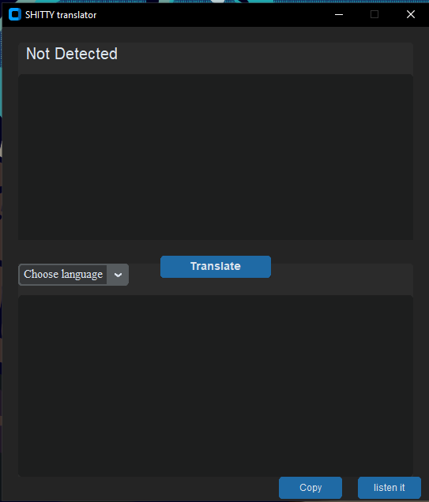

# Sitty-Translator
un traductor de mierda tan basico que hasta tu podrias replicarlo. 

Aplicación de escritorio para traducir textos entre más de 100 idiomas con un solo clic.  
Incluye lectura en voz alta y función de copiar.

## 📷 Capturas de pantalla

### Interfaz principal

## 🚀 Cómo usar

1. Escribe o pega el texto a traducir en la entrada superior.
2. Selecciona el idioma de destino en "Choose language".
3. Haz clic en "Translate" para traducir.
4. Usa "Copy" para copiar tu cosa en el portapapeles.
5. Usa "Listen it" para escuchar lo que pusiste con un acento gringo bien mierda robotico alv.

## ⚙️ Requisitos

- Sistema operativo: Windows 7 SP1, 8, 8.1, 10, 11 (solo 64 bits)
- Python NO necesario, es portable
- Se recomienda tener instaladas las **Microsoft Visual C++ Redistributable** (2022)

## 📥 Descargar

[Descargar Traductor (.exe)](https://drive.google.com/file/d/11nMCr0l42ruRHKq5tY368GDCyg2QdsEW/view)
Tamaño: 75.7 MB
